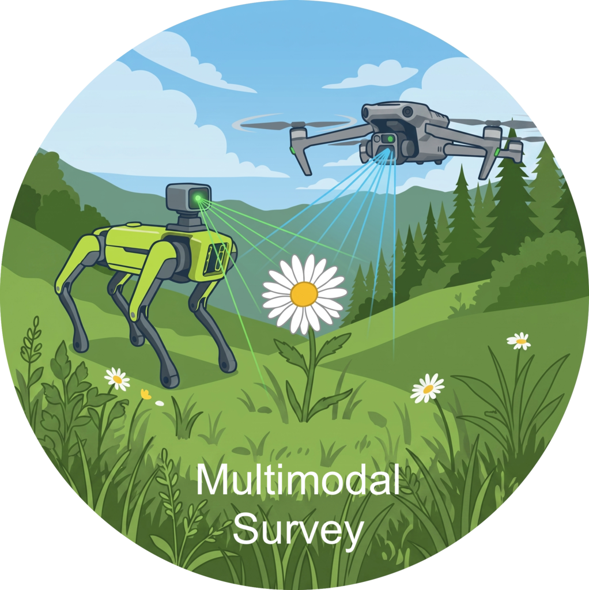

<p align="center">
  
</p>

# Multimodal Survey

This project explores the Unitree Go2 robot as a platform for botanical surveys in a wildlands setting. Our Go2 traversed several kilometers of transects across the grasslands at MPG Ranch and photographed the vegetation at regular intervals. Aerial drone data were also gathered at the same time. In addition to targeting the paired dataset for release, the project explores how DINOv3 models fine-tuned on iNaturalist images transfer to the task of plant ID on the robot-gathered images. Additionally, we hope to learn how joint captures of a scene from terrestrial and aerial perspectives can improve plant detection and mapping.

## Repo layout

```
multimodal_survey/
├── missions/              survey definitions + everything the robot recorded
│   ├── <site>/<strip>/    one folder per strip surveyed (config, runs, labels)
│   ├── inventory.csv      per-run status + quality tracker
│   └── planning/          QGIS project + basemap for laying out strips
├── inat_dataset/          training photos, harvested from iNaturalist via pixelflora
├── multimodal_dataset/    turns robot missions into one dataset, plus the labeling app
├── dev/                   experiments + scratch; the model is in lupins_dinov3_demo/
└── docs/                  standalone guides (e.g. the field walkthrough)
```

### `missions/` — what the robot did

One folder per strip surveyed, named `<site>/<strip>/` (e.g. `site_1/strip_3`).
Each holds:

* `mission.toml` — the run configuration (leg geometry, capture interval, steering).
* `seed_poly.geojson` — the strip's boundary, drawn by hand in QGIS.
* `waypoints.geojson` — the leg corners, generated from the seed polygon by
  `go2-survey make-waypoints` (regenerating this is a desk task, not a field
  task — don't hand-edit it).
* `mission_layout.png` — a preview image of the route.
* `runs/<run_id>/` — one folder per time the robot actually walked the strip (a
  strip is often walked more than once, on different days). Each run holds the
  photos (`captures/*.jpg`, geotagged and bearing-tagged, with a JSON sidecar per
  photo and a `captures.geojson` manifest), the field logs (`main.log`, `gps.log`,
  `imu.log`, `battery.log`), and, once a person has labeled it,
  `labels/image_multilabel.json`.

`inventory.csv`, at the top of `missions/`, tracks every run's status (complete /
partial / aborted) and basic quality checks. A run only counts as usable once its
`main.log` reaches `MISSION COMPLETE`.

`missions/planning/` holds the QGIS project (`ranch_map.qgz`) and basemap
(`ranch_map.gpkg`) used to lay out strips before they become each mission's
`seed_poly.geojson`.

**Running a survey in the field** — the full procedure (clone onto the dog,
pre-flight, run, push the results) lives in
[`docs/field-walkthrough.md`](docs/field-walkthrough.md).

### `inat_dataset/` — training photos

Not robot photos — these come from iNaturalist, harvested by
[**pixelflora**](https://github.com/mosscoder/pixelflora). Two requests live
here, each pairing a `request.toml` (which species, which filters) with the
`out/` it produced (a Hugging Face dataset, plus the images and manifests
[pixelflora](https://github.com/mosscoder/pixelflora) writes alongside it):

* `plants/` — the candidate pool of rangeland species (native and invasive forbs
  and grasses) the model is trained and tuned against.
* `birds/` — bald-eagle-in-flight photos, used to build the "Sky" negative class.

### `multimodal_dataset/` — bridging robot data and the model

A small, self-contained package that reads every completed mission out of
`missions/` and assembles them into one Hugging Face dataset — one row per photo,
carrying its location, time, heading, and (once labeled) its species labels. Run
with `python -m multimodal_dataset`.

It also holds the **labeling app**, a local web tool used to hand-label robot
photos:

```bash
python -m multimodal_dataset.labeling label  --mission site_1/strip_5            # unbiased ground-truth labeling
```

## Roadmap

- [x] **Review the robot mission data for completeness.** Every run reached
  `MISSION COMPLETE` with its captures, sidecars, and logs intact (status
  tracked in `missions/inventory.csv`).
- [ ] **Label the target species in the robot imagery and push to Hugging
  Face.** Hand-label the captures with the labeling app, then build the dataset
  (`python -m multimodal_dataset`) and publish it.
- [ ] **Process the drone imagery and add it to the dataset** as its own drone
  configuration, co-registered with the robot captures by location and time.
- [ ] **Benchmark the iNaturalist-trained CV stack on the robot imagery** —
  robot captures alone, then the union with the drone imagery — to measure how a
  model trained only on free iNaturalist photos transfers to the field.
- [ ] **Fuse the terrestrial and aerial views:** pair each robot capture with the
  overlapping drone imagery and test whether the joint signal improves plant
  detection and mapping over either source alone.

