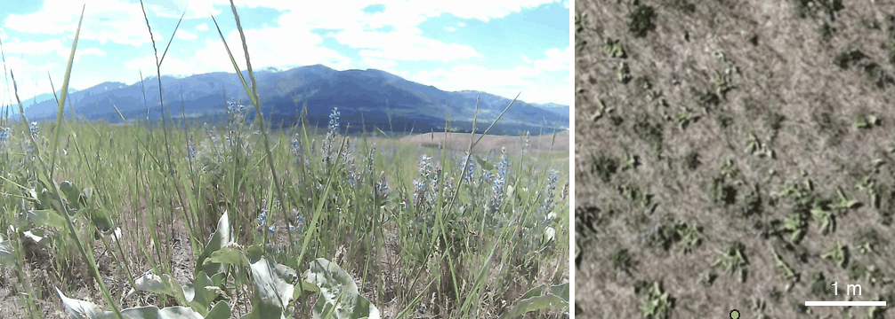
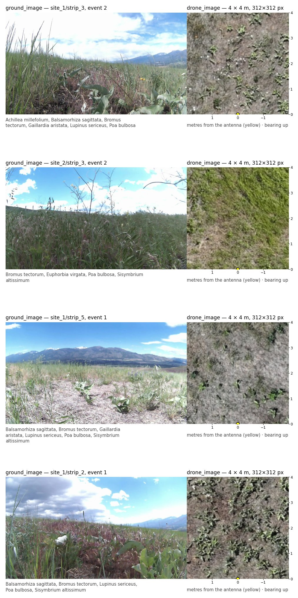
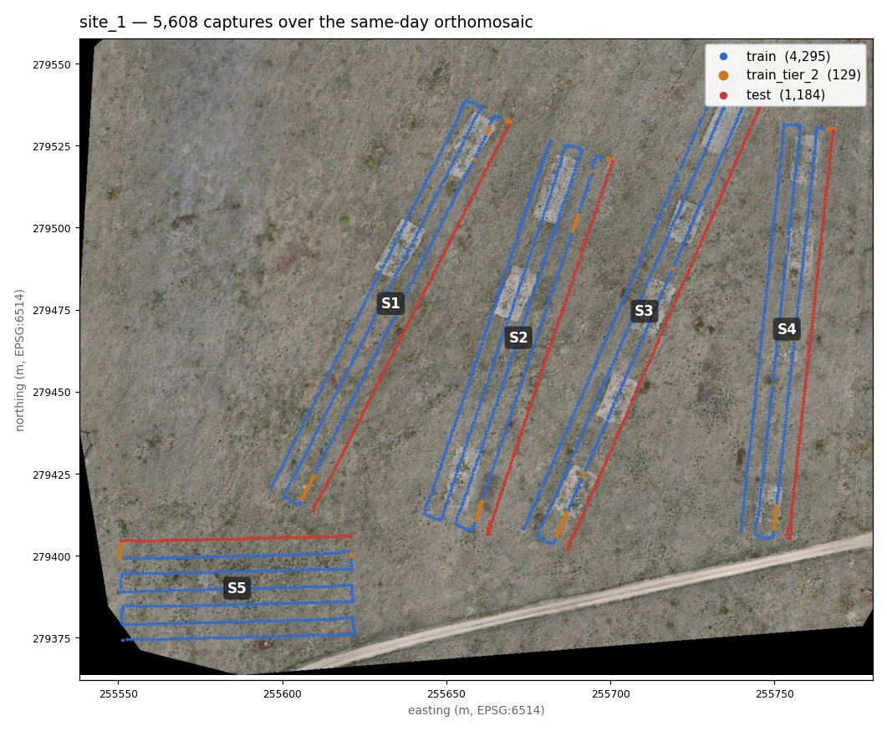
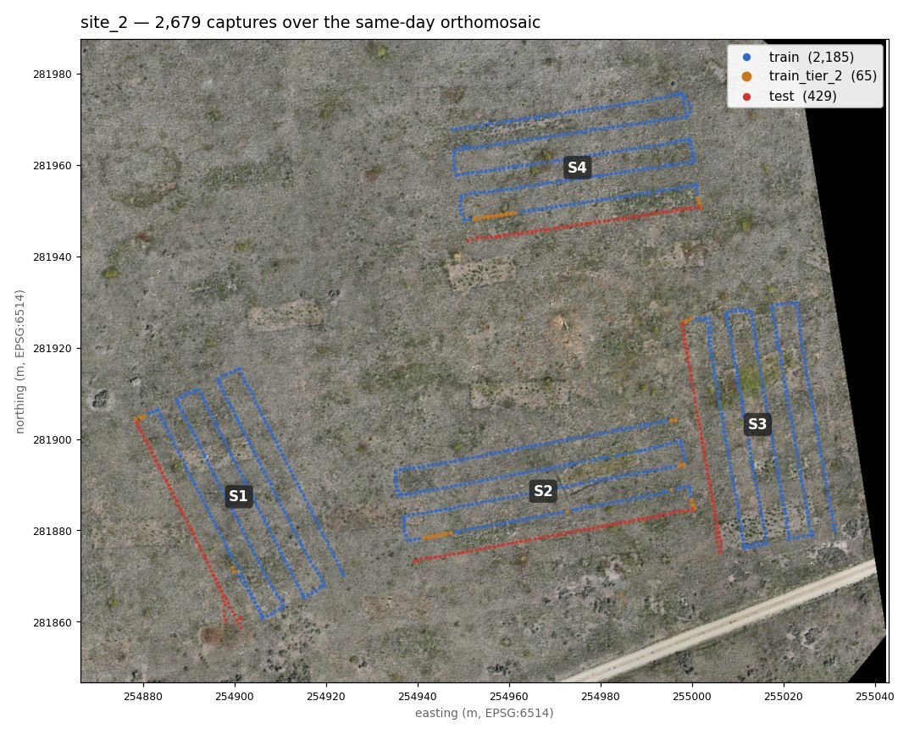
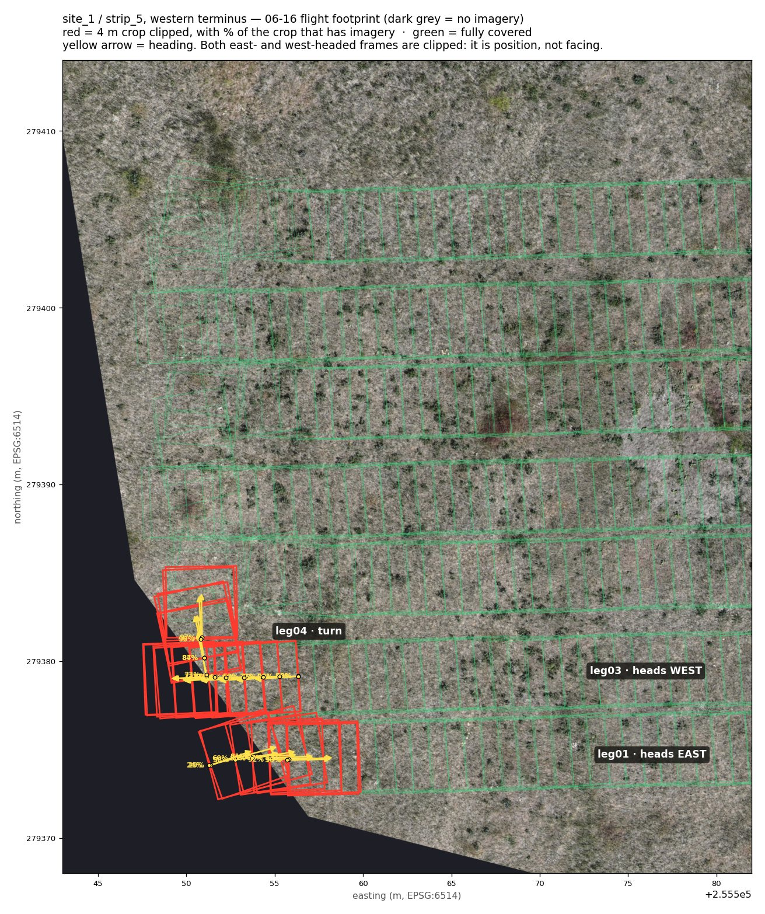
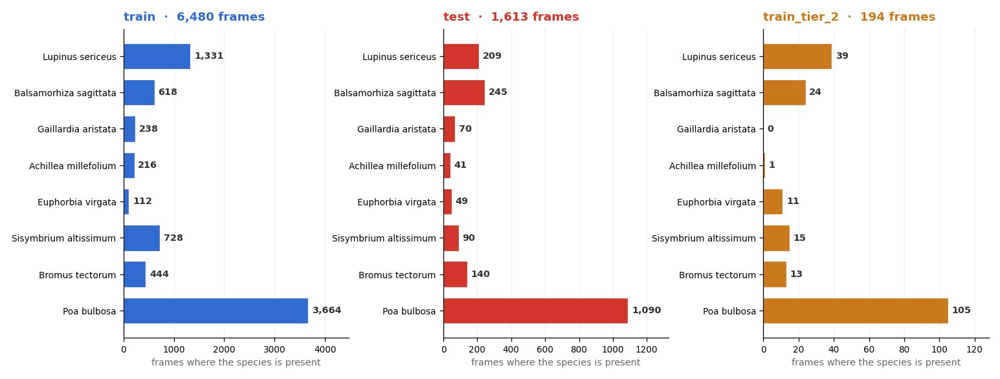
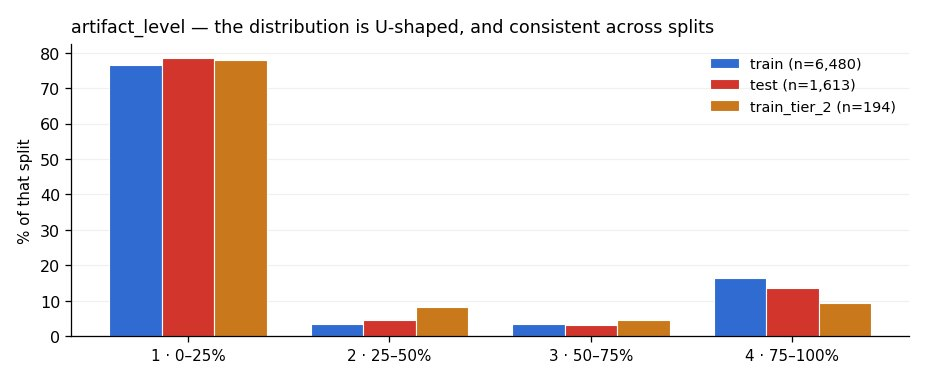

# MPG Ranch multimodal survey: robot config

Can seeing a plant from the ground *and* from the air improve automated species
identification? Paired ground-level and overhead imagery of Montana grassland,
hand-labeled for 8 plant species, built to answer that question.

**8,287** labeled frames · **8** target species · **2** sites, 9 strips ·
**1.4 cm** RTK accuracy · **1.28 cm** drone GSD · **34** columns



Thirty five consecutive capture positions along one survey leg. The robot
photograph is on the left. Its paired 4 m by 4 m drone crop is on the right,
rotated so the robot's bearing points up, with the antenna position in yellow
and a 1 m scale bar.

## 1. Contents and motivation

Identifying plant species from photographs is hard from any single vantage
point. A camera at ground level sees leaf shape, flower color, and growth
habit, but stems overlap and distant plants shrink to a few pixels. A camera
looking straight down sees the spatial arrangement of vegetation clearly, but
flattens the very structure that distinguishes one species from another. Each
view holds information the other lacks. This dataset exists to test whether
combining them improves species classification over either alone. A
four-legged robot walked parallel transects across two grassland sites at MPG
Ranch in western Montana, photographing the vegetation ahead of it every
meter, with each camera position surveyed to centimeter accuracy. A drone
photographed the same ground from above, usually within a few hours of the
walk and always within a day, and its imagery was stitched into a seamless
overhead map. Every row of the dataset pairs one ground-level photograph with
the 4 × 4 m patch of overhead imagery directly in front of the robot at that
moment. A botanist reviewed every one of the 8,287 frames for the presence of
eight target species (four native wildflowers and four invasive weeds) and, in
a separate pass, graded each image's quality. Each transect was covered twice,
from the ground and the air alike, so the same vegetation appears under two
different sets of field conditions.

### Features

| Feature | Type | Notes |
|---|---|---|
| **Identity & imagery** | | |
| `frame_id` | string | Capture stem: the join key and the source file name |
| `ground_image` | Image | The robot photograph: 1280×720 JPEG, ground-level, near-horizontal, wide-angle |
| `drone_image` | Image | Paired nadir orthomosaic crop, 4 × 4 m at 1.28 cm GSD → 312×312 px, cut at the frame's RTK antenna position. The orthomosaics were rectified against surveyed ground-control points at both sites, so crop placement and robot positions share a common geodetic frame |
| **Labels** | | |
| `species` | Sequence(ClassLabel) | Which of the 8 target species are present. Variable length 0 to 6. Empty means reviewed and none present |
| `artifact_level` | ClassLabel(4) | Share of the frame degraded by visual artifacts, in quartile bands |
| **Where** | | |
| `site` | string | `site_1` or `site_2` |
| `strip` | string | `strip_1` … `strip_5` within a site |
| `latitude` | float64 | WGS84 latitude of the **GNSS antenna**, interpolated to the shutter instant. The camera and the imaged ground both lie forward of this point |
| `longitude` | float64 | WGS84 longitude of the **GNSS antenna**, same basis as `latitude` |
| `altitude_ellipsoidal_m` | float64 | Ellipsoidal height of the **GNSS antenna**, 1178 to 1200 m. The antenna rides above the ground surface |
| `accuracy_horizontal_m` | float64 | Receiver-reported, 1.4 to 1.7 cm. Trustworthy where `fix_type` is 6 |
| `accuracy_vertical_m` | float64 | 1.0 to 1.7 cm, same caveat |
| `fix_type` | int8 | GNSS solution state at the shutter: 6 (RTK fixed) on 8,285 frames, 5 (RTK float) on 2. The two float frames report the same centimeter accuracy, which is optimistic. This column is the honest flag |
| `pdop` | float64 | Position dilution of precision, 0.88 to 1.25 across the release |
| `satellites_used` | int8 | Satellites in the solution, 23 to 32 |
| `bearing_deg` | float64 | Post-processed from the RTK track. Matches the image's EXIF `GPSImgDirection` |
| `footprint_wkt` | string | The crop outline on the ground: a WKT polygon in WGS84 lon/lat, corners ordered antenna-left, antenna-right, front-right, front-left. For map overlay and spatial joins. Re-cropping the image itself needs no geometry (section 2) |
| **When** | | |
| `ground_captured_at` | string | Shutter instant of the robot frame, ISO 8601 with offset |
| `drone_captured_at` | string | The median source-photo timestamp of the flight that produced this row's `drone_image`, from the PPK camera log. The mosaic is a composite, so its center-of-mass in time stands in for an instant. Flights ran 5.5 to 19.6 min |
| `capture_offset_absolute` | float64 | Hours from `drone_captured_at` to `ground_captured_at`, signed. Positive means the ground frame came after the flight median. Median 1.16 h, max 20.29 h |
| `capture_offset_time_of_day` | float64 | The same offset with the date discarded: clock-time difference only, wrapped to ±12 h. Median 1.16 h, max 4.35 h |
| `capture_event` | int8 | Visit ordinal per (site, strip), 1 or 2. See the caveat below |
| `mission_restart_utc` | string, nullable | Set only on the 31 frames captured after a 17.7 h mid-run resume, and null elsewhere |
| **Cross-event pair** | | |
| `pair_frame_id` | string, nullable | `frame_id` of the frame at the same (leg, mark) in the strip's other capture event, and null on the 153 frames whose mark was walked only once |
| `pair_distance_m` | float64, nullable | Antenna separation between the paired captures: median 0.10 m, 95th percentile 0.33 m, max 2.12 m |
| `pair_overlap_fraction` | float64, nullable | Share of this 4 m crop covered by the paired frame's crop |
| `pair_offset_hours` | float64, nullable | Time between the paired captures: 3.0 to 3.4 h at `site_2`, 48 to 71 h at `site_1` |
| **Along the transect** | | |
| `leg` | string | `leg01` to `leg13`. Odd legs are survey lines, even legs the turns between them |
| `along_leg_m` | float64 | **Nominal** grid position, 0 to 150 m. True position is ~3.5 cm off (median). Use lat/lon when precision matters |
| `frame_offset_s` | float64 | Shutter offset from the intended 1 m mark, the only per-frame record of timing jitter |
| `speed_mps` | float64 | 0 to 1.46 m/s |
| **Provenance & split** | | |
| `run_id` | string | e.g. `strip_3_2026-06-16_11-29-48`. Links a row back to the source repository's `missions/` tree |
| `tier2_overlap_fraction` | float64, nullable | Share of this crop shared with a test crop. Populated on `train_tier_2` rows only |
| `drone_coverage` | float64 | Fraction of the 4 m crop that falls inside its flight's imagery footprint. 1.0 for all but 33 frames at `site_1/strip_5`'s western terminus (14 on event 1, 19 on event 2), where it drops as low as 0.08. All 33 are train or connector frames. The test leg is fully covered on both flights |

### The two capture events

Every strip was walked twice, and each walk is paired with its own drone
flight. No two passes see the same conditions. Even at the same clock time,
illumination, cloud, wind, and plant posture all differ. The two events are
best read as **two independent condition samples** of the same ground rather
than a controlled contrast. The interval between them differs by site, and the
repeat is spatial rather than exact.

| Site | Interval between the two events | Character |
|---|---|---|
| `site_2` | 3.0 to 3.4 h, same day | Morning and afternoon walks of the same strip, a within-day contrast |
| `site_1` | 48 to 71 h | A revisit two to three days later. Strips 1 and 5 were re-walked at nearly the same time of day |

The robot follows the same nominal 1 m grid on both passes, but it does not
land in the same place twice. Matching `leg` and mark across the two events,
the antenna positions differ by:

| Separation at the same (leg, mark) | Value |
|---|---|
| median | 10.1 cm |
| 75th percentile | 14.9 cm |
| 95th percentile | 32.6 cm |
| 99th percentile | 65.6 cm |
| maximum | 2.12 m |
| within 10 cm | 49.0% |
| within 25 cm | 91.6% |
| within 50 cm | 97.9% |
| within 1 m | 99.8% |

A (leg, mark) pair therefore marks the same neighborhood revisited rather than
a fixed quadrat. 4,067 marks appear in both capture events. The remaining 153
appear in only one, where a frame was skipped on one pass. Per strip the
medians run 6.8 to 14.9 cm and the worst single case is 2.12 m on
`site_2/strip_1`. That is close enough to treat the pair as the same patch of
vegetation and too loose to treat it as a fixed plot. The pairing is recorded
on every row. `pair_frame_id` identifies the counterpart frame, and
`pair_distance_m`, `pair_overlap_fraction`, and `pair_offset_hours` quantify
the separation.

### The flights

| Flight | Paired with | Photos per sensor | Duration | Median capture (UTC) | RGB GSD |
|---|---|---|---|---|---|
| 260616-site-1-am | `site_1` event 1 | 295 | 19.6 min | 18:02:05 | 1.28 cm |
| 260617-site-2-am | `site_2` event 1 | 154 | 5.5 min | 17:04:07 | 1.28 cm |
| 260617-site-2-pm | `site_2` event 2 | 147 | 5.5 min | 20:23:59 | 1.28 cm |
| 260618-site-1-pm | `site_1` event 2 | 265 | 9.9 min | 20:33:34 | 1.28 cm |

All four flights flew the same plan: identical footprints per site, 9 m photo
spacing, matching altitude. The first flight of the campaign ran at 2.2 m/s,
half the 4.4 m/s of the other three, which is the whole story behind its
longer duration; photo spacing and overlap are unaffected. Timestamps come
from the PPK camera logs (GPS time corrected for leap seconds). Ground-control
targets surveyed at both sites anchored the orthomosaic rectification.
Per-flight processing reports did not expose ground-control residuals, so
per-flight RMSE is not available.

## 2. Paired examples

The left column shows the robot's ground-level photograph. The right column
shows the orthomosaic crop for the same frame, rotated so the robot's bearing
points up, with the antenna at the bottom-edge midpoint (yellow).



The nadir view is mostly bare ground with discrete plants. The robot's oblique
view foreshortens the same scene into apparently continuous cover. Both are
accurate. A ground-level camera simply stacks many meters of vegetation into a
few degrees of elevation.

> **The drone crop is its own coordinate system.** Rows are meters ahead of
> the antenna, columns are meters to the side, and one pixel is 4/312 m
> (1.28 cm), so any smaller or repositioned crop is plain array slicing with
> no projection or rotation math (code in section 5). The `footprint_wkt`
> column places the same square on a map for GIS work. Image work never needs
> it.

## 3. Splits

The split follows a single rule. **The test set is an outermost leg of every
strip**, `leg01` in eight of the nine and `leg13` in `site_1/strip_5` for the
reason below. The assignment was made on geometry and imagery coverage, never
on the labels. Every other frame is a training candidate. Because both capture
events walk the same legs, the split groups them automatically, so the same
ground never straddles the train/test boundary.

| Split | Frames | Share | Definition |
|---|---|---|---|
| `train` | 6,480 | 78.2% | Zero crop overlap with any test frame |
| `test` | 1,613 | 19.5% | The outermost leg of all 9 strips, both capture events |
| `train_tier_2` | 194 | 2.3% | Its 4 m crop intersects a test crop. Inclusion is optional |




Every capture, colored by split, over the site's own orthomosaic. The red test
legs sit on the outside of each strip. The amber tier-2 frames hug them. At
site 1, S5's test leg is on its eastern side rather than its western one. See
below. At site 2, S3's test leg runs alongside S2. The strips abut, which is
where the cross-strip overlaps come from.

### Why `site_1/strip_5` uses `leg13`

That strip's `leg01` runs off the western edge of both flights' footprints.
Fourteen frames are clipped against the 06-16 ortho and 19 against the 06-18
ortho, some retaining as little as 8% of their 16 m². A test frame missing
most of its aerial context is a degraded evaluation point, so the test leg
moves to the strip's other outermost leg, `leg13`, which is fully covered on
**both** flights.



The clipping follows from **position** rather than heading. `leg01` heads east
and is clipped at its *start*. `leg03` heads west and is clipped at its *end*.
Both meet the same patch of ground at the strip's western terminus, where the
footprint edge cuts diagonally. Only these two legs and the `leg04` turn are
affected. Legs 05 through 13 are fully covered, and site 2 is clean
throughout.

> **The 33 clipped frames do not disappear.** They sit in train or on
> connector turns, where a partial aerial crop is far less damaging than in an
> evaluation set, and each carries its true footprint fraction in
> `drone_coverage`. Coverage has been validated against **all four flights**
> at native resolution. Clipping is confined to `site_1/strip_5`'s western
> terminus on both of its flights (the 06-18 footprint cuts slightly deeper,
> reaching legs 07 through 11). Site 2 is clean throughout, and the `leg13`
> test leg is fully covered everywhere.

### Why `train_tier_2` exists

Adjacent survey legs are 4.1 to 5.3 m apart, and a 4 m crop reaches 2.0 m
laterally, and further once the bearing wanders off the leg axis. So a small
number of training crops cover ground that also appears in a test crop. Rather
than delete them, they are labeled and set aside.

| Leg | Frames | Why it lands in tier 2 |
|---|---|---|
| `leg03` | 126 | The survey leg adjacent to a `leg01` test leg |
| `leg02` | 44 | The turn joining `leg01` to `leg03`, whose ground comes within 0.21 m of the test leg. Only 42% of the 106 turn frames qualify. The rest stay in clean train |
| `leg12`, `leg10` | 16 | `site_1/strip_5`: the neighbors of its `leg13` test leg |
| `leg05`, `leg09` | 8 | `site_2/strip_2`. Its legs run alongside `strip_3`'s test leg where the two strips abut |

> **The zero-overlap guarantee applies to the drone crops only.** The ground
> camera is oblique and wide-angle. A train frame on `leg03` photographs
> test-leg terrain 5 m away in essentially every frame, at distance and
> foreshortened. That ground-modality leakage is inherent to the survey
> geometry and is not quantified. The guarantee is limited to the aerial
> modality. No **4 m drone crop** in `train` shares any ground with a test
> crop.

> **Training on `train` alone is exactly clean in the aerial modality**,
> verified by polygon intersection over every crop pair rather than a distance
> heuristic. Adding `train_tier_2` puts 2.50% of the evaluated pixels on
> ground the model has seen, touching 213 of the 1,613 test crops.
> `tier2_overlap_fraction` supports partial inclusion. The median is 4.5% and
> the maximum 62.6%, so a threshold recovers most of those frames while
> leaving the worst behind. This matters most for *Euphorbia virgata*, the
> rarest class, which has 11 of its 123 training positives in tier 2.

## 4. Labels

Eight target species, four wildflowers and four weeds, labeled by presence in
the frame. Labels were assigned from a blank slate, with nothing pre-checked
and no model predictions shown, by a **single annotator per task** (one for
species, one for `artifact_level`). No inter-annotator agreement data exists.
A frame with an empty list was reviewed and had no target present (23% of
frames).



| Species | Common name | Group | train | test | tier 2 | total | of all frames |
|---|---|---|---|---|---|---|---|
| *Lupinus sericeus* | silky lupine | wildflower | 1,331 | 209 | 39 | 1,579 | 19.1% |
| *Balsamorhiza sagittata* | arrowleaf balsamroot | wildflower | 618 | 245 | 24 | 887 | 10.7% |
| *Gaillardia aristata* | blanketflower | wildflower | 238 | 70 | 0 | 308 | 3.7% |
| *Achillea millefolium* | common yarrow | wildflower | 216 | 41 | 1 | 258 | 3.1% |
| *Euphorbia virgata* | leafy spurge | weed | 112 | 49 | 11 | 172 | 2.1% |
| *Sisymbrium altissimum* | tall tumblemustard | weed | 728 | 90 | 15 | 833 | 10.1% |
| *Bromus tectorum* | cheatgrass | weed | 444 | 140 | 13 | 597 | 7.2% |
| *Poa bulbosa* | bulbous bluegrass | weed | 3,664 | 1,090 | 105 | 4,859 | 58.6% |

> **The class balance is steep.** *Poa bulbosa* appears in 58.6% of frames and
> *Euphorbia virgata* in 2.1%, a 28× spread. Frames carry 0 to 6 species at
> once (median 1), which is why `species` is a variable-length list rather
> than a fixed multi-hot vector.

A machine-readable species table ships beside the data as
[`species.csv`](species.csv) (genus, species, common name).

### Image quality

A second annotation pass graded every frame for the share degraded by visual
artifacts (motion blur, smear, glare, compression). The distribution is
U-shaped rather than graded. Bands 2 and 3 are mostly motion blur, band 4
mostly encoder corruption.



> **The robot's own corruption flag is uninformative here.** Every frame
> reports `corrupt = false`, including all 1,304 frames a human graded as
> band 4. To select clean imagery, filter on `artifact_level`.

### Suggested metric

Report a one-vs-all F1 per species plus their macro average. With the class
balance above, a single pooled number hides exactly the classes this dataset
is hardest on.

```python
import numpy as np
from sklearn.metrics import f1_score

# y_true, y_pred: (n_frames, 8) binary arrays in the canonical class order
per_species = f1_score(y_true, y_pred, average=None)
macro = f1_score(y_true, y_pred, average="macro")
for name, f1 in zip(CLASSES, per_species):
    print(f"{name:24s} {f1:.3f}")
print(f"{'macro average':24s} {macro:.3f}")
```

Choosing a decision threshold per species is part of the task. Use the
provided splits as-is so results stay comparable.

## 5. Loading the dataset

### Basic

```python
# pip install datasets
from datasets import load_dataset

# the clean training split: 6,480 frames, zero test-crop overlap
train = load_dataset("mpg-ranch/multimodal-survey", split="train")
test  = load_dataset("mpg-ranch/multimodal-survey", split="test")

row = train[0]
row["ground_image"]  # PIL.Image, 1280x720: the robot photograph
row["drone_image"]   # PIL.Image, 312x312: 4x4 m nadir crop, bearing up
row["species"]       # ['Lupinus sericeus', 'Poa bulbosa']
row["artifact_level"]# 0  (band 1: 0-25% of the frame degraded)
```

### Species labels to a multi-hot vector

```python
import numpy as np

CLASSES = train.features["species"].feature.names   # canonical order, 8 classes

def multi_hot(batch):
    v = np.zeros((len(batch["species"]), len(CLASSES)), dtype=np.int8)
    for i, ids in enumerate(batch["species"]):
        v[i, ids] = 1                               # species are stored as class ids
    return {"labels": v}

train = train.map(multi_hot, batched=True)
```

### Filtering

```python
# drop the heavily degraded frames (band 4)
BANDS = train.features["artifact_level"].names
clean = train.filter(lambda r: r["artifact_level"] != BANDS.index("75-100%"))

# ground frames captured close in time to their drone imagery
tight = train.filter(lambda r: abs(r["capture_offset_time_of_day"]) < 1.0)

# one site, one capture event
morning = train.filter(lambda r: r["site"] == "site_2" and r["capture_event"] == 1)

# frames where a particular species is present
spurge = train.filter(lambda r: CLASSES.index("Euphorbia virgata") in r["species"])
```

### Including tier 2

```python
# all 194 of them: accepts 2.50% evaluated-pixel contamination
t2 = load_dataset("mpg-ranch/multimodal-survey", split="train_tier_2")

# or only the mildly-overlapping ones, e.g. under 10% of the crop shared
t2_mild = t2.filter(lambda r: r["tier2_overlap_fraction"] < 0.10)

from datasets import concatenate_datasets
train_plus = concatenate_datasets([train, t2_mild])
```

### Using the pair

```python
import torch
from torchvision.transforms.functional import to_tensor

def collate(batch):
    # the robot frame is oblique and wide-angle. The crop is nadir and metric.
    # They cover overlapping ground but are NOT pixel-registered to each other.
    robot = torch.stack([to_tensor(b["ground_image"].resize((640, 360))) for b in batch])
    drone = torch.stack([to_tensor(b["drone_image"]) for b in batch])   # 3x312x312
    y     = torch.tensor(np.stack([b["labels"] for b in batch]), dtype=torch.float32)
    return robot, drone, y

loader = torch.utils.data.DataLoader(train, batch_size=32, collate_fn=collate)
```

### Re-cropping the drone image

```python
# the crop is a metric chart: rows are meters ahead of the antenna, columns meters left.
# A smaller or shifted window is array slicing. No projection knowledge is needed.
N, S = 312, 4.0
PX = N / S                                      # 78 px per meter

def sub_crop(drone_image, ahead, left, size):
    # (ahead, left): window center in meters from the antenna
    a = np.asarray(drone_image)
    r = round(N - (ahead + size / 2) * PX)      # row 0 is 4 m ahead
    c = round(N / 2 - (left + size / 2) * PX)   # column 0 is 2 m left
    return a[r : r + round(size * PX), c : c + round(size * PX)]

patch = sub_crop(row["drone_image"], ahead=1.0, left=0.0, size=2.0)  # 2 x 2 m, 156 x 156 px
```

### Recovering the geometry

```python
# each drone crop spans 0 to 4 m ahead of the antenna and +/-2 m across,
# rotated so `bearing_deg` points up the image. To place a crop pixel on the ground:
import math

def pixel_to_ground(row, px, py, S=4.0, N=312):
    th = math.radians(row["bearing_deg"])
    fwd = S * (1 - (py + 0.5) / N)          # meters ahead of the antenna
    lat = S * (0.5 - (px + 0.5) / N)        # meters to the left
    dE  = fwd * math.sin(th) - lat * math.cos(th)
    dN  = fwd * math.cos(th) + lat * math.sin(th)
    return dE, dN                            # offset in meters, EPSG:6514
```

## 6. Prior work

Several lines of research connect overhead and ground-level views for organism
classification, but only the first below fuses the two as joint classifier
input. The others use one view to supervise, label, or direct the other.
Releases that combine aerial and ground platforms serve SLAM, registration,
navigation, and crop phenotyping. To our knowledge none pairs ground-robot
photographs with coincident centimeter-scale orthomosaic crops of the same
footprints, labeled for plant species in natural vegetation. The closest
neighbors:

### The Auto Arborist Dataset (CVPR 2022)

Beery et al. ([paper](https://openaccess.thecvf.com/content/CVPR2022/html/Beery_The_Auto_Arborist_Dataset_A_Large-Scale_Benchmark_for_Multiview_Urban_CVPR_2022_paper.html)). Pairs aerial and street-level imagery of more than two million urban trees
across 23 North American cities for genus-level classification, with baselines
for each view alone and for the two combined. It was assembled by joining the
cities' public tree censuses to Street View and overhead imagery, and its
central experiment is geographic generalization. Models are evaluated in
cities held out of training.

### TaxaBind (WACV 2025)

Sastry et al. ([paper](https://arxiv.org/abs/2411.00683)). Learns a joint embedding over six modalities, using ground-level species
photos as the anchor that binds satellite imagery, location, text, audio, and
environmental features, and evaluates it on zero-shot species classification.
The core technique, multimodal patching, distills each pairwise alignment into
the shared ground-image encoder without erasing the ones learned before it,
trained on 2.7 million satellite-to-species-photo pairs.

### WildSAT (ICCV 2025)

Daroya et al. ([paper](https://arxiv.org/abs/2412.14428)). Trains satellite-image encoders by contrasting them against millions of
geotagged citizen-science wildlife observations and habitat descriptions,
transferring ground-level signal into the overhead view. Its contribution is
the training signal itself: a contrastive objective linking a satellite patch
to the species recorded there and to Wikipedia habitat text, which beats both
ImageNet and satellite-specific pretraining on downstream recognition tasks.

### GeoLifeCLEF (annual benchmark)

Picek et al. ([2024 overview](https://hal.inrae.fr/hal-04720817v1)). Predicts plant species composition at ground-observation sites from satellite
imagery and environmental rasters, linking the overhead view to species
recorded in person at the same coordinates. Recent editions pair roughly five
million occurrence records and 100,000 standardized survey plots across Europe
with Sentinel-2 patches, Landsat time series, and climate and soil rasters,
scored as multi-label species composition prediction.

### Aerial-ground robotics for precision farming (IEEE RAM 2021)

Pretto et al. ([paper](https://arxiv.org/abs/1911.03098)). The EU Flourish project teamed a survey drone with an intervention ground
robot, classifying crops and weeds from both platforms over the same field,
the closest operational precedent for the drone-plus-robot pairing here. The
demonstrated loop runs from a multispectral drone survey to a weed map
co-registered into the ground robot's frame, which the robot then acts on
plant by plant with targeted spraying or mechanical stamping.

### MuST-C (Scientific Data 2026)

Chong et al. ([paper](https://www.nature.com/articles/s41597-025-06462-y)).
Releases ground-robot photographs and drone orthophotos at millimeter GSD of
the same crop plots across a season, co-registered through shared GNSS
georeferencing, the closest dataset precedent to the pairing here. The trial
is a monoculture experiment where species are known by design, annotations
are plant traits rather than species labels, and no per-footprint image pairs
are curated.

### Outdoor robot imagery datasets (RUGD, RELLIS-3D, GOOSE)

A ground-robot lineage releases outdoor imagery for semantic segmentation.
RUGD ([Wigness et al.](https://doi.org/10.1109/IROS40897.2019.8968283)) and
RELLIS-3D ([Jiang et al.](https://github.com/unmannedlab/RELLIS-3D))
established the off-road benchmark line, GOOSE
([Mortimer et al.](https://goose-dataset.de/)) carries the finest current
ontology at 64 classes, and its GOOSE-Ex extension adds the only annotated
quadruped-mounted imagery to date, with vegetation appearing throughout as
coarse structural classes such as grass, bush, and tree, never as botanical
species.

### DeepWeeds (Scientific Reports 2019)

Olsen et al. ([paper](https://www.nature.com/articles/s41598-018-38343-3)).
Releases 17,509 ground-level images of eight named weed species across
Australian rangeland, the nearest ecosystem and label-type match to this
dataset. Capture used a fixed camera rig at robot height rather than a robot
in motion, labels are image-level, and no aerial imagery is paired.

## Citation and license

Data are released under CC BY 4.0. Code in the source repository
([mosscoder/multimodal_survey](https://github.com/mosscoder/multimodal_survey))
is MIT. See [`CITATION.cff`](CITATION.cff) in this repository for the
preferred citation. The build is reproducible from the source repository:
`python -m multimodal_dataset build` at commit `SOURCE_COMMIT`.
